<!-- Animated Typing Headline -->
<h1 align="center">
  
</h1> 

<!-- Banner -->

  

<!-- Profile Views -->

  

---

## 👋 Hi, I'm **Md Ibrahim Sarkar**

I’m a **MERN Stack Developer** who is gradually moving towards **Backend Development**.

Right now, I’m **exploring backend engineering concepts** and learning **Golang, Docker and Kubernetes**, with a long-term goal of becoming a **Backend Developer by mid-2026**.

I believe in **learning step by step**, building real projects and being honest about what I know and what I’m still learning.

---

## 🔧 What I Work With

### 🧠 Backend (Current Skills)
- **Node.js**
- **Express.js**
- REST API development  
- CRUD operations  
- Authentication with **JWT & Firebase**

### 🌐 Frontend (Supporting Skills)
- **React.js**
- **Tailwind CSS**
- **Responsive UI design**

### 🗄 Databases
- **MongoDB** (current)
- **PostgreSQL** (learning)

---

## Currently Exploring & Learning

> Beginner level — learning with practice and small projects

- **Golang (Go)** – Basics & simple REST APIs  
- **Docker** – Container fundamentals  
- **Kubernetes** – Core concepts (intro level)  
- **Redis** – Basic caching ideas  
- **CI/CD** – Basic understanding
- **Linux** – Command-line & server  

---

## 🛠 Tech Stack

  

---

## 🎯 Career Goal

🎯 **Goal:** Become a **Backend Developer by mid-2026**

📌 Focus areas:
- Strong backend fundamentals  
- Golang for backend services  
- Databases & API design  
- Docker & Kubernetes basics  
- Real-world backend projects  

---

## 🔗 **Connect with me**

  

---

## 📊 GitHub Stats

  

  

---

## 🧠 Mindset

- 📚 Learning consistently  
- 🛠 Building projects while learning  
- 🧩 Improving backend knowledge step by step  
- 🚀 Focused on long-term growth  

---

🔥 Learning backend engineering takes time — and I’m enjoying the journey.  
🚀 Let’s grow and build together.
